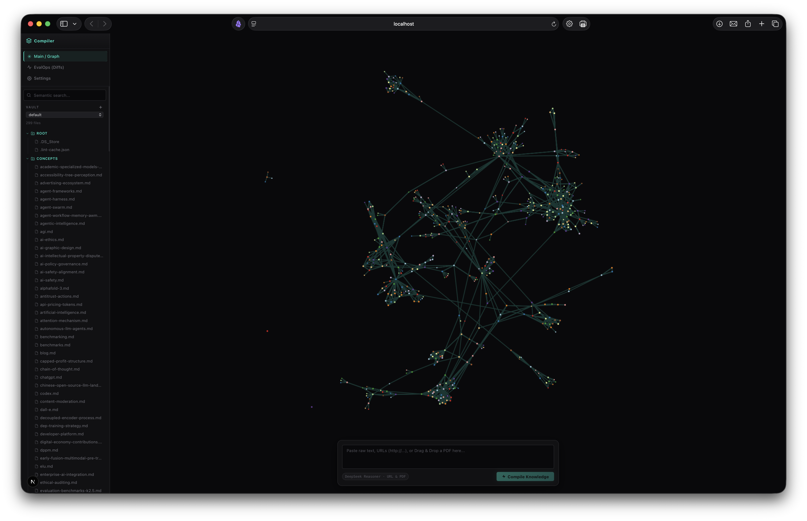

# Braniac Desktop

Braniac is a local-first knowledge IDE: Markdown vaults remain the source of truth, while a Rust core provides Git history, [qmd](https://github.com/tobi/qmd) semantic search, graph layout, ingest jobs, and a sandboxed plugin runtime. The UI is a Tauri 2 + Vite + React editor-first shell.



## Stack

| Layer | Technology |
|---|---|
| Desktop shell | Tauri 2, Vite, React 19, TypeScript |
| Core | Rust (`braniac-core`, `braniac-types`) |
| Vault storage | Markdown + per-vault Git (`git2`) |
| Metadata / embeddings cache | SQLite (`rusqlite`) |
| Search | [qmd](https://github.com/tobi/qmd) hybrid query (`qmd update` + `qmd embed` on Rebuild Index) |
| Graph | `petgraph` wikilink model + Rust ForceAtlas2-style layout, canvas renderer |
| Plugins | Manifest permissions + local plugin folder |

## Repository layout

```
apps/desktop/          Tauri app + React frontend
crates/braniac-core/   Domain logic (vault, index, graph, jobs, plugins)
crates/braniac-types/  Shared serde types
vaults/                Demo markdown vaults (default, test, deepblue)
plugins/example/     Example plugin manifest + entry script
docs/                  Architecture notes + migration guide
img/                   Historical web prototype screenshots
```

## Prerequisites

- macOS (primary target for v1)
- Rust stable (`cargo`)
- Node.js >= 20

## Development

```bash
# install frontend deps
npm --prefix apps/desktop install

# run desktop app in dev mode
npm run desktop:dev

# verification suite (Rust + frontend)
npm run check
```

## Tauri commands (public API)

`vault_list`, `vault_open`, `vault_files`, `vault_migrate`, `document_read`, `document_write`, `search_query`, `index_status`, `index_rebuild`, `graph_snapshot`, `graph_layout_start`, `job_start_ingest`, `job_cancel`, `history_log`, `history_diff`, `plugin_install`, `plugin_enable`, `settings_get`, `settings_update`.

## Migration

See [docs/MIGRATION.md](./docs/MIGRATION.md) for moving from the retired Next.js prototype.

## Academic note

Portfolio / master's application context remains in [ACADEMIC_PROJECT_NOTE.md](./ACADEMIC_PROJECT_NOTE.md) and [docs/project-overview.md](./docs/project-overview.md).
