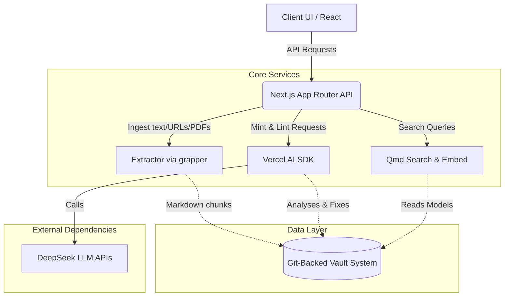
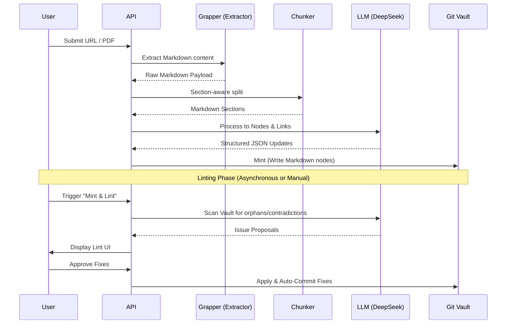
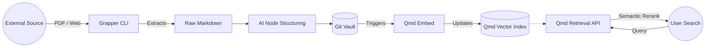

# AI Knowledge Compiler: Architecture & Workflow

**Author**: Ognjen Jovanovic

This document outlines the high-level architecture, the ingest and compilation workflows, and the synchronization strategy between components in the AI Knowledge Compiler.

---

## 1. High-Level Architecture

The AI Knowledge Compiler is built on a robust local-first architecture, leveraging **Next.js**, React, and the Vercel AI SDK to integrate multiple tools seamlessly. The core capabilities involve unstructured parsing via `grapper` and hybrid semantic search via `qmd`.

### Key Components

- **Client UI**: Built with React 19, provides visual graph navigation (`react-force-graph-2d`) and ingest interfaces.
- **Next.js Backend**: App Router handles the API logic for scraping, semantic embedding, and search retrieval.
- **Grapper**: A CLI-based scraping utility configured locally to convert unstructured inputs (PDFs, robust web pages) into Markdown.
- **Qmd**: Local-first vector and semantic search engine that indexes the Git-backed vault, enabling lightning-fast LLM-reranked text retrieval.
- **Vault System**: A file-based, Git version-controlled knowledge graph enforcing localized state.

---

## 2. Ingestion & Linting Workflow

Transforming raw knowledge into interconnected markdown assets involves an iterative **Mint & Lint** process. The system safely buffers updates, detects inconsistencies, and provides interactive suggestions before committing.

### Mint & Lint Process Snapshot

---

## 3. Synchronization: Qmd and Grapper

The interaction between the raw extractor (`grapper`) and the semantic search engine (`qmd`) ensures that newly acquired information is instantly searchable.

1. **Extraction Pipeline**: `grapper` ingests source content (e.g., academic PDFs) with high fidelity.
2. **Structuring**: We chunk and mint these into nodes in our file system.
3. **Synchronization Trigger**: Upon a successful Git commit in the Vault (handled via async mutex to prevent conflicts), a background indexation task triggers `qmd embed`.
4. **Search Readiness**: Within seconds, the vector capabilities of `qmd` absorb the new context, allowing subsequent semantic searches to retrieve and navigate the freshly integrated concepts.

---

## UI Screenshots Overview

### Landing Page & Architecture

### Knowledge Node Exploration

---
*Generated for the AI Knowledge Compiler documentation, 2026, by Ognjen Jovanovic.*
