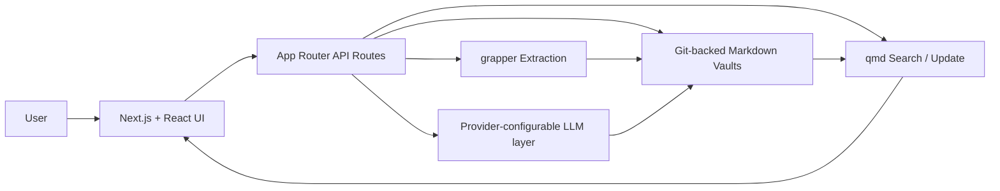
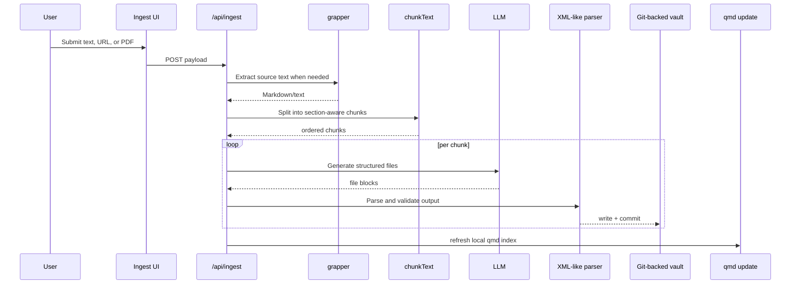
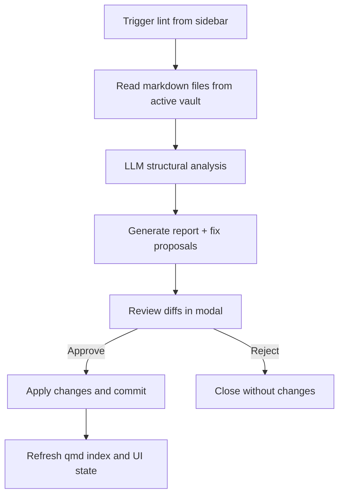

# Architecture and Workflow

This document is the technical companion to [project-overview.md](./project-overview.md). It focuses on how the system is structured, how knowledge moves through the application, and how vault integrity is maintained over time.

## High-Level Architecture

Braniac uses a local-first architecture built around a Next.js App Router frontend, API routes for orchestration, a file-based markdown vault, and two local command-line tools: `grapper` for extraction and `qmd` for retrieval.

### Core Components

- `src/components/`: graph view, ingest panel, search, vault selector, lint modal, and EvalOps surfaces
- `src/app/api/`: ingestion, lint, search, metrics, and vault-management routes
- `src/lib/extractor.ts`: local `grapper` integration for URLs and PDFs
- `src/lib/vaultManager.ts`: filesystem and Git operations for vault state
- `src/lib/qmd.ts`: local semantic retrieval and background index refresh

## Ingestion Workflow

The ingest path turns raw input into markdown files that can be searched, linked, and versioned.

## Search and Navigation Workflow

Graph navigation and semantic search are designed to complement each other rather than compete.

The graph is generated directly from stored markdown files by scanning `[[wikilinks]]`, which means the visualization and the stored knowledge structure stay aligned.

## Mint and Lint Workflow

The "Mint & Lint" flow is intentionally human-reviewed. The model proposes changes, but the user approves them before they are written back to the vault.

## Data Model and Vault Layout

Each vault is a local directory with its own Git history. The current implementation uses lightweight folder conventions rather than a database schema.

| Folder | Purpose |
|---|---|
| `concepts/` | conceptual or thematic pages |
| `entities/` | people, companies, models, tools, institutions |
| `sources/` | source-origin pages and extraction anchors |
| `events/` | notable time-bounded items |
| root files | overview documents such as `index.md`, `glossary.md`, `log.md` |

## UI Reference

## Implementation Notes

- The app supports multiple vaults and persists the active vault in local storage.
- Ingest and lint models are configurable through the Settings page.
- The repository includes sample vaults to make the demo immediately inspectable.
- Lint caching is used to skip previously healthy files when possible.

## Known Boundaries

- The system is single-user and local-first by design.
- Extraction and indexing rely on local CLI availability.
- AI-generated knowledge is reviewable, but not guaranteed correct.
- The current graph is optimized for explorable knowledge artifacts, not for very large collaborative deployments.
