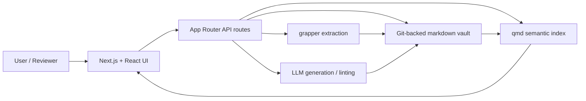
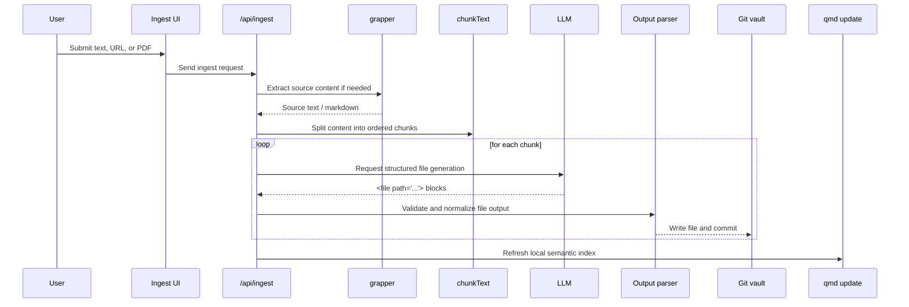
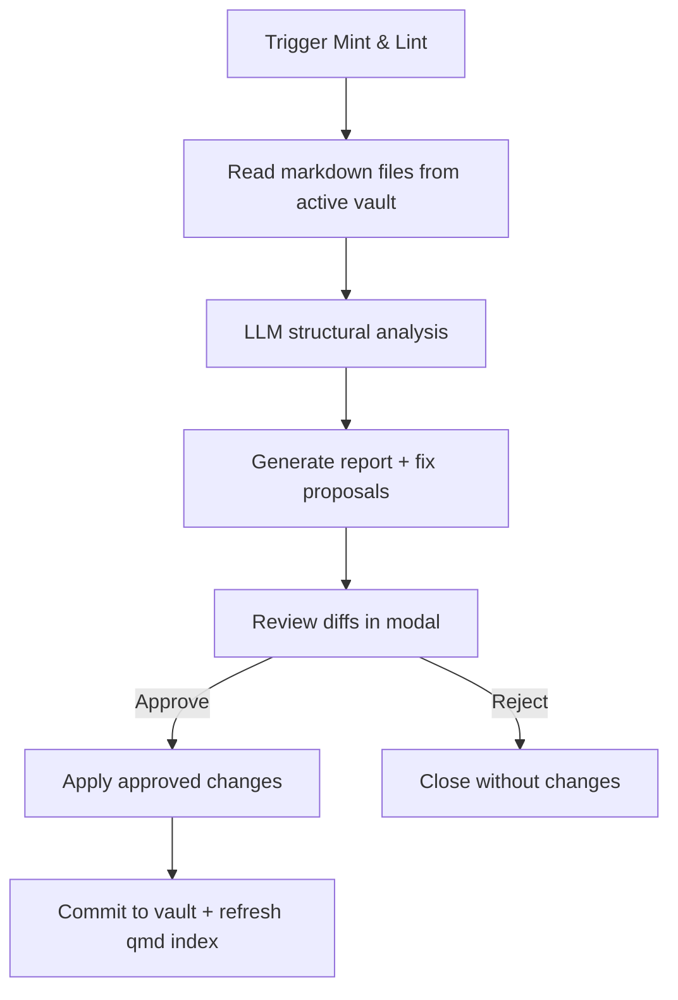

<div align="center">

# AI Knowledge Compiler

## Braniac: Local-First Knowledge Graph Compilation and Exploration

**Author:** Ognjen Jovanovic  
**Date:** April 25, 2026  
**Repository:** [github.com/h01t/braniac](https://github.com/h01t/braniac)

**Academic note:** This document presents Braniac as a research and engineering prototype prepared for a master's application portfolio. It is intended to demonstrate technical depth, local-first systems thinking, and clear documentation rather than claim production readiness.

</div>

---

## Abstract

Braniac is a local-first **Tauri desktop application** for transforming raw inputs such as text, URLs, and PDFs into a structured markdown knowledge graph. The system combines a React UI, Rust core services, provider-configurable LLM workflows, a Git-backed vault model, semantic retrieval through `qmd`, and a human-reviewed "Mint & Lint" governance loop.

The main contribution of the repository is not a novel model on its own, but an end-to-end knowledge compilation workflow: ingest, structure, search, visualize, review, and document. For an academic portfolio, the value lies in showing how model-assisted systems can remain grounded in local files, version history, and explicit human approval rather than opaque automation.

## Problem Statement and Motivation

Research workflows often begin with messy source material: articles, PDFs, copied notes, and fragmented references. Traditional note-taking tools make it easy to collect material but much harder to convert it into a coherent, explorable graph of concepts and sources. At the same time, fully automated AI summaries often lose provenance, structure, or user trust.

Braniac was built around three practical questions:

1. Can raw material be converted into linked markdown knowledge assets with minimal manual formatting?
2. Can the resulting knowledge base remain local-first, transparent, and versioned instead of hidden behind a database or hosted service?
3. Can AI-generated cleanup and maintenance remain reviewable enough to be suitable for a public academic showcase?

The project answers these questions with a prototype that deliberately keeps the storage model simple, the generated artifacts inspectable, and the review workflow visible.

## System Overview

Braniac consists of four layers:

- a **Tauri + React** desktop shell for graph exploration, ingestion, settings, and history review
- **Tauri commands** that orchestrate extraction, search, linting, and vault operations
- a local toolchain built around `grapper`, `qmd`, and Git-backed markdown vaults
- a provider-configurable LLM layer used for page generation and lint analysis


*Figure 1. Main workspace showing the graph-centered interface and ingestion entry point.*

### Platform Summary

| Layer | Responsibilities | Main Technologies |
|---|---|---|
| Presentation | Graph view, ingest panel, search, settings | React 19, Vite, Tauri 2 |
| Orchestration | Tauri commands, job manager, vault resolver | Rust (`braniac-core`) |
| Knowledge Storage | Markdown vaults, Git history, file graph | filesystem, `git2` |
| Retrieval | Local search and snippet lookup | `qmd`, SQLite metadata |
| AI Layer | page generation and lint analysis | configurable providers (DeepSeek/OpenAI) |

## Architecture and Data Model

The project uses a deliberately inspectable architecture: raw inputs become markdown files, markdown files become graph nodes, and vault commits become the audit trail.



*Figure 2. High-level architecture linking the frontend, API routes, local tooling, and vault state.*

### Vault Structure

| Folder | Role |
|---|---|
| `concepts/` | ideas, topics, and abstractions |
| `entities/` | people, organizations, models, tools, institutions |
| `sources/` | source-oriented records and extraction anchors |
| `events/` | time-bounded items or milestones |
| root documents | `index.md`, `glossary.md`, `log.md`, and other overview files |

This layout was chosen because it is human-readable, Git-friendly, and easy to inspect in a public repository. The graph is derived directly from the stored markdown files and their `[[wikilinks]]`, so the visualization and the source artifacts remain aligned.

## Ingestion and Compilation Workflow

The ingestion path converts source material into structured, linked markdown pages while preserving a reviewable file-level output.



*Figure 3. Ingestion path from raw source material to committed markdown artifacts.*

### Why This Workflow Matters

- The output is not hidden in a database; it becomes normal markdown files in the repository.
- Each page generation step is committed, making state transitions inspectable.
- Section-aware chunking helps the model work with large documents without losing structural boundaries.
- The pipeline is local-first and tool-assisted rather than dependent on a hosted backend.

## Search, Navigation, and EvalOps

Braniac combines semantic retrieval with direct graph navigation so users can both query and browse the same knowledge space.


*Figure 4. Search results feed directly into graph navigation and markdown inspection.*


*Figure 5. Node detail panel with rendered markdown and clickable internal links.*

The repository also includes an EvalOps page that exposes vault history and file diffs. This is useful in an academic context because it makes the evolution of the knowledge base legible instead of hidden behind "latest state only" behavior.


*Figure 6. EvalOps surface for reviewing vault commit history and diffs.*

## Mint and Lint Governance Workflow

The linting system is designed as a review workflow, not a blind auto-fix loop. The model proposes structural changes, but the user explicitly approves them before they are written back to the vault.



*Figure 7. Human-reviewed lint workflow that keeps AI suggestions visible before application.*


*Figure 8. Review-first lint interface with proposal diffs and approval toggles.*

### Why This Design Choice Is Important

- The project stays transparent even when AI is involved in maintenance.
- Diff review reduces the risk of silent corruption in a generated knowledge graph.
- The workflow is easier to present publicly because the "AI step" is visible and bounded.

## Repository and Implementation Notes

The repository is structured to be understandable to reviewers without requiring hidden infrastructure.

```text
src/app/                    pages and API routes
src/components/             graph, ingest, lint, search, and shell UI
src/lib/                    extraction, vault, parser, qmd, and utility logic
docs/                       architecture notes and submission-ready overview
img/                        screenshots used in documentation
vaults/                     sample knowledge vaults for demo inspection
```

### Implementation Highlights

- the layout is split into a server-side `layout.tsx` and a client-side shell component, which keeps metadata and navigation concerns cleanly separated
- search and index refresh logic now use a small dedicated `qmd` helper instead of shell-string duplication
- vault state and markdown outputs are typed and easier to trace in the codebase
- the build and lint pipeline now passes cleanly, which makes the public repository more defensible

## Demo Readiness and Public Presentation

The project is demo-ready because it combines:

- a working interactive UI
- bundled sample vaults for immediate inspection
- a clear README and technical companion docs
- a standalone submission-ready overview document
- explicit academic framing and a standard open-source license

This matters in a master's application context because the repository is not only functional; it is also explainable. Reviewers can understand what the system does, how it is built, and where its boundaries are.

## Limitations and Honest Scope

Several limitations should remain visible in any public or academic presentation:

- Braniac is a single-user, local-first prototype rather than a collaborative platform.
- The quality of generated knowledge depends on the selected model and the source material.
- `grapper` and `qmd` are external local tools and must be available in the environment.
- Lint proposals are intentionally human-reviewed because full automation would be harder to trust.
- The included vaults are example corpora, not a curated benchmark or gold-standard dataset.

These limitations are not failures to hide; they are part of the project's honest scope.

## Conclusion and Future Work

Braniac succeeds as an academic software artifact because it turns a messy real-world problem into a coherent, inspectable workflow. The system demonstrates full-stack application design, local-first tooling, AI-assisted structuring, Git-based traceability, and careful documentation.

The most valuable future work would focus on:

- improving source provenance and citation handling
- making index-refresh and background-job status more explicit in the UI
- adding stronger tests around parsing and vault operations
- improving large-vault performance and graph scaling
- formalizing export workflows for submission PDFs and archival snapshots

Presented honestly, Braniac is a strong engineering prototype and a credible master's application repository.

## Appendix

### Appendix A. Reproducible Commands

```bash
git clone https://github.com/h01t/braniac.git
cd braniac
npm install
cp .env.example .env.local
npm run dev
```

```bash
npm run lint
npm run build
```

### Appendix B. Environment Variables

| Variable | Purpose |
|---|---|
| `DEEPSEEK_API_KEY` | default provider for ingest and lint settings |
| `OPENAI_API_KEY` | optional provider key if switching models in the Settings page |
| `GRAPPER_PATH` | optional override for the local `grapper` executable |
| `QMD_BIN` | optional override for the local `qmd` executable |

### Appendix C. PDF Export Note

This markdown file is designed to serve as the canonical source for later PDF conversion. The diagrams are authored directly in Mermaid so they remain editable in GitHub and in Markdown-aware export workflows. If a PDF export is needed later, the recommended approach is to render the markdown to HTML with relative assets enabled and then print that HTML to PDF.

### Appendix D. Mermaid Source

#### D1. System Architecture


#### D2. Ingestion and Compilation Workflow


#### D3. Search and Navigation Workflow


#### D4. Mint and Lint Governance Workflow


